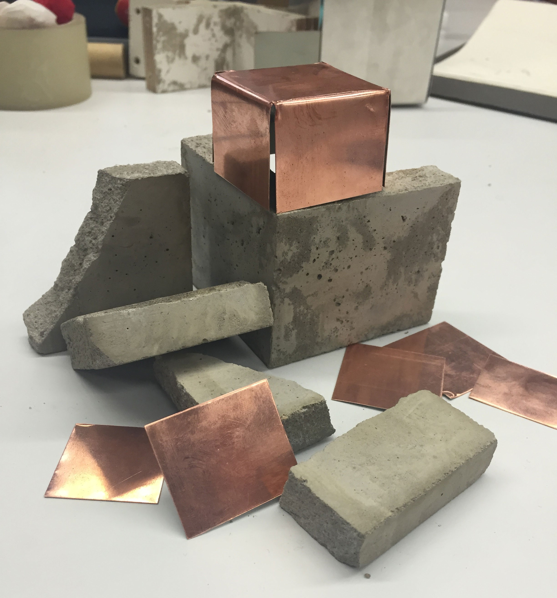
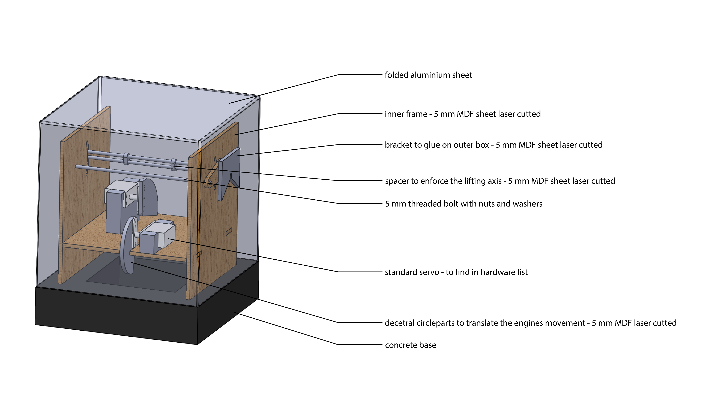
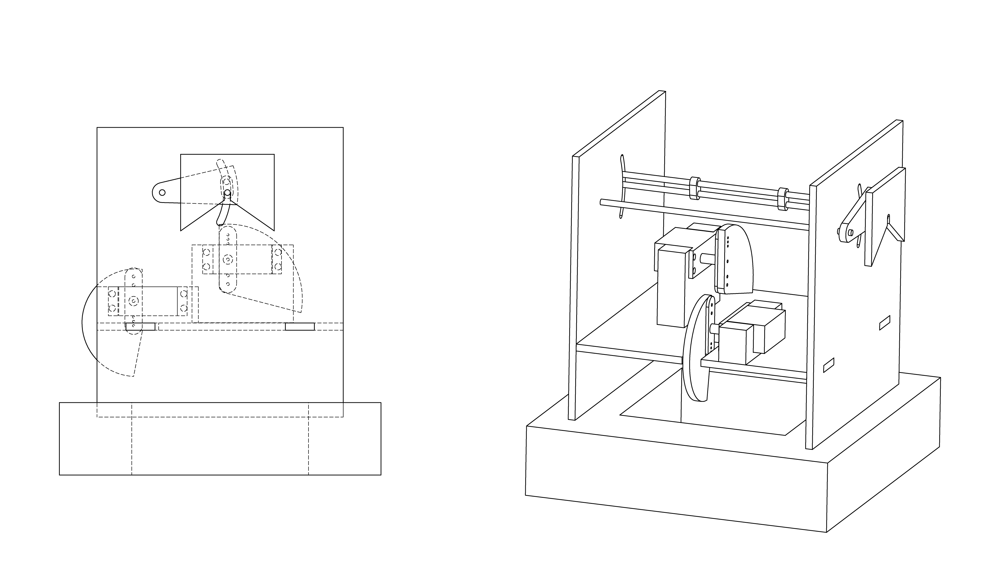

 [![ZenHub] (https://raw.githubusercontent.com/ZenHubIO/support/master/zenhub-badge.png)] (https://zenhub.io) 

# TRANSL8R – Play the _Chinese whispers_ game with machines

*Watch our video on Vimeo.*

## Introduction
TRANSL8R is a chain of multilingual machines to play the _Chinese whispers_ game with, meant to be shown in an exhibition context.
It consists of four boxes. The first box listens to the visitor's message and repeats it out loud. The second box listens to the first one and translates that message into a different language. The third and fourth one each do the same (every box speaks a different language). Finally, the first box translates the message back into the original language. In an ideal case, that message would be the same as the original one, but the little mistakes of the translation engine make for a funny ending, just as in the _Chinese whispers_ game.

## Tech specs

The four boxes are custom-made cubic machines with various mechanical elements and electronics. Each box consists of:

- **An LED:** To indicate that the box is speaking
- **Two servo motors:** To move the box as it listens and speaks and to give it a living character
- **An infrared sensor:** To detect the presence of a person standing in front of it and start the audio recording
- **A microphone:** To record the person's voice
- **A speaker:** To play back the messages
- **A Particle Photon:** To control the whole process via Wi-Fi

We also used:
- **A Mac mini**: To record, translate and play back the messages

## Design

The base is made of concrete and looks like a thick frame. On top of it there is a structure of medium-density-fibreboard that holds everything together: the photon board, the microphone, the LED, as well as the two servo motors that make the lifting and tilting movements possible. For the cover, we bent a thin aluminium plate to create a five-sided cube.
The four boxes are on top of a black, custom-made table, in which the infrared sensor, the speakers, the Mac mini and all the cables are hidden.

## How it works
In reality, the boxes don't really "listen" to each other as with a microphone; everything is done at once by a computer and played back simultaneously with the movement of the boxes. This is what really happens:

0. The IR sensor is placed under the first box. As soon as someone gets closer than 30cm to the table, the next step is triggered.
1. The servo motors lift and tilt the first box.
2. A welcoming messaged is played back by the speaker, asking the visitor to say something.
3. The microphone records the visitor's message.
4. The first box tilts back, as it is about to say something. At the same time, the second box lifts and tilts, as if it were about to "listen" to its sibling.
5. The speaker plays back the visitor's message in German. Under the hood, the computer is translating it into the three remaining languages and back to German.
6. The second box tilts back and the speaker plays back the translation in Spanish. The first box moves back to its original position, while the third box is already in "listening" mode.
7. Now the third box tilts back and the speaker plays back the translation in English. The second box moves back to its original position, while the fourth box is in "listening" mode.
8. The fourth box tilts back and the speaker plays back the translation in Arabic. The third box moves back to its original position, while the first box is in "listening" mode.
9. Finally, the first box tilts back and the speaker plays back the last translation (German). The fourth box moves back to its original position.
10. The first box moves back, too, ready for the next visitor.

## The process

### The base reference
This was our third and last project of the semester. Our assignment was to develop and build a system consisting of four different modules. Each module should have a Particle Photon with an Internet connection as well as sensors that would trigger something (like a temperature sensor that would make an LED blink once a certain temperature was reached, for instance). Such an activated module would then send a signal to the next one, which would do something as well, and send a signal to the next one until all four had successfully done 'something'.
Four groups were formed, each tasked with the creation of one unique module. And that was it. We had to figure out the rest for ourselves.

#### Initial ideas

After hours of brainstorming, we came up with several ideas. Here are some of the more funny and original ones:
- **The four temperaments:** "A proto-psychological theory that suggests that there are four fundamental personality types, sanguine (optimistic and social), choleric (short-tempered or irritable), melancholic (analytical and quiet), and phlegmatic (relaxed and peaceful)." (Wikipedia) Using these personality types, we wanted to question whether it is possible to create machines with a certain temperament.
- **Black boxes:** The idea was to create a kind of treasure hunt using at least twenty black boxes that looked the same. The visitors would have to find the 'real' four boxes with the leads inside of them.
- **Moralizer:** A judging robot that would scream whenever someone did something immoral, like lighting a cigarette.
- **TRANSL8R:** Four boxes that play the Chinese Whispers game (sound familiar?!) translating a message into several languages and then back into the original one.

#### Our final choice
We ended up choosing the latter. This led us to restructure the groups, since we needed a consistent design and the same programming for all boxes.
Two new groups were formed: _Product design & Mechanics_ and _Hardware & Software_.

### Product design & Mechanics
Early on, the team developed a simple lifting and tilting system.

Copper and concrete were chosen as external materials as both share an interesting texture and have colours that complement each other well.

Unfortunately, we realised that copper was heavier than expected, which meant we would need more powerful and considerably costlier servo motors to lift the copper cover. That was not an option, so the lighter (and cheaper!) aluminium it was.

_Cutting the aluminium_

_Glueing the aluminium together_

_The concrete in the custom-built molds_

_Building the first prototype_

_Laser-cutting the structure parts (medium-density-fibreboard)_

_Finishing the table_

#### How-to

You can download the original Ai file [here](images/TRANSL8R-How-to.ai).

### Hardware & Software

Check out the detailed documentation of the [software](https://github.com/FH-Potsdam/connecting-bits/wiki/The-Software) and the [hardware](https://github.com/FH-Potsdam/connecting-bits/wiki/The-Hardware) in the Wiki.

## About Us

We are students from the [University of Applied Sciences of Potsdam](http://fh-potsdam.de) aka [@fh-potsdam](https://github.com/FH-Potsdam). Our team consists of interface, product, and graphic designers that took part in the course _Input Output – Introduction to process-oriented design_ by [Fabian Morón Zirfas](https://github.com/fabiantheblind). This project was developed during the last third of the course. To see the other projects we made, visit [this repository](https://interface.fh-potsdam.de/eingabe-ausgabe/2015-2016/).

- [Wolfgang Albrecht](https://github.com/wollemannone)
- [Marta Carlesso](https://github.com/martakarta)
- [Julia Freyhoff](https://github.com/antsteelmule)
- [Paul Klinski](https://github.com/Logetcrea)
- [Nina Komarova-Zelinskaya](https://github.com/Ninotschka)
- [Dustin Kummer](https://github.com/miduku)
- [Bela Kurek](https://github.com/Q-rec)
- [Andre Nagusch](https://github.com/Ourelius)
- [Joshua Pacheco](https://github.com/josues)
- [Laura Pau Bielsa](https://github.com/lpaubielsa)
- [Nikolas Ripka](https://github.com/nikoripka)
- [Jo Swarzynska](https://github.com/swjo)
- [Daria Thies](https://github.com/dariaDunkelbier)
- [Lucas Vogel](https://github.com/vogelino)
